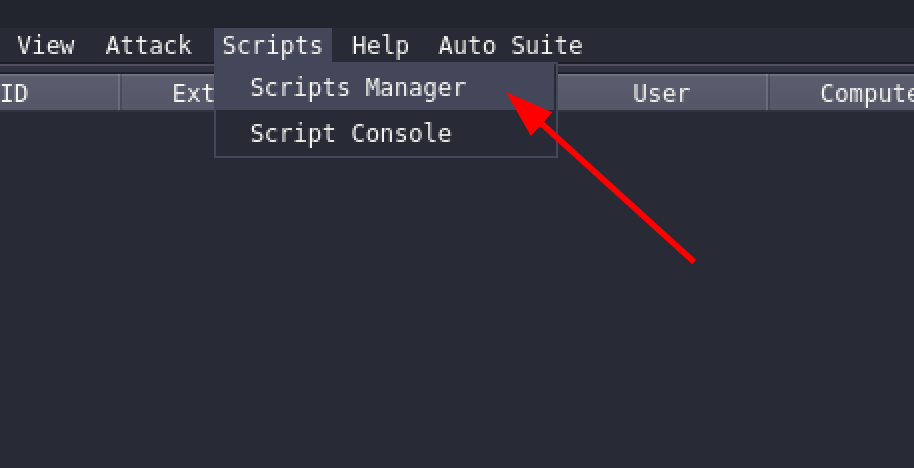
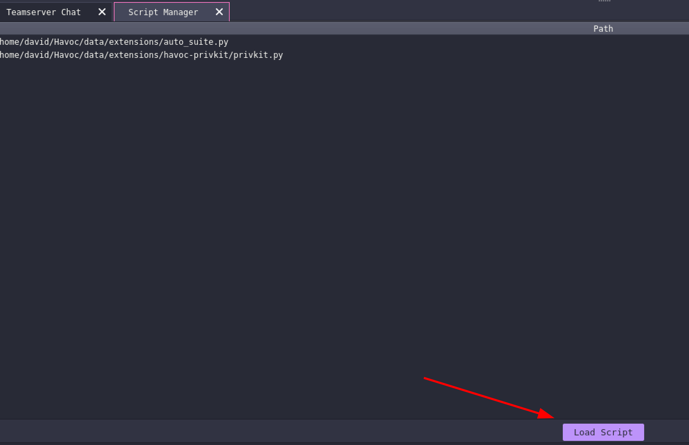
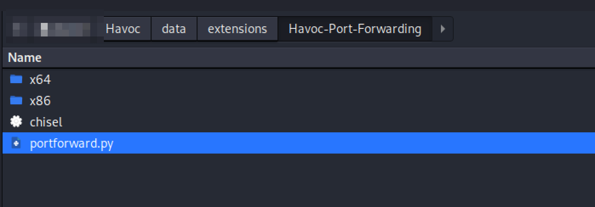
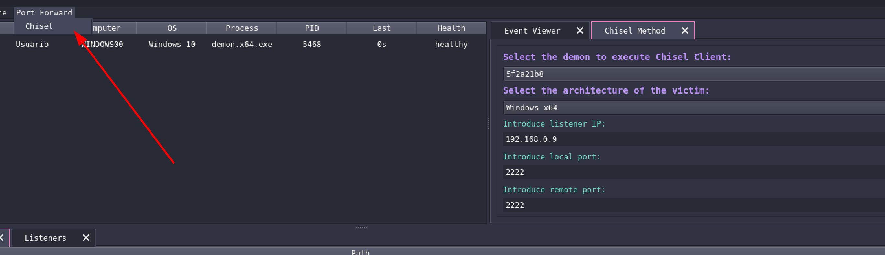
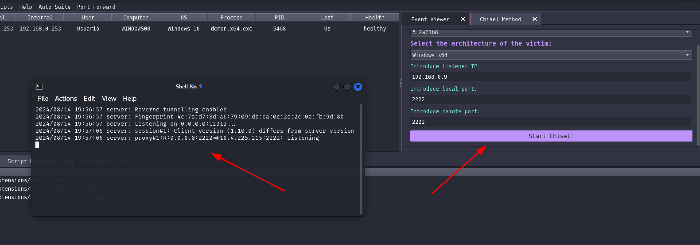
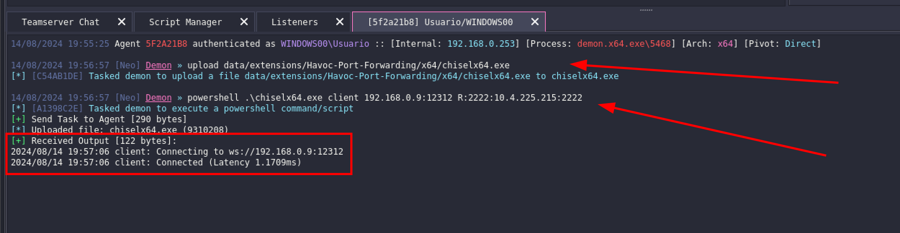
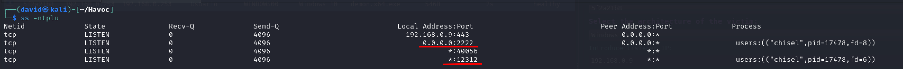

# Havoc Port Forwarding with different methods

This project is an extension for the Havoc C2 framework that implements port forwarding using the Chisel tool at the moment. It provides a graphical interface to select demons, configure ports, and execute Chisel in both server and client modes. This extension is specifically tailored for Linux distributions like Kali Linux, Arch, Debian, Ubuntu, etc.

## Features

- **Demon Selection:** Choose which demon will execute the Chisel client.
- **Architecture Support:** Supports both x86 and x64 architectures for the Chisel client.
- **Customizable Ports:** Configure local and remote ports for the Chisel tunnel.
- **Listener Configuration:** Specify the listener IP for the Chisel connection.
- **Terminal Execution:** Automatically opens a new terminal to run the Chisel server, supporting `gnome-terminal`, `xterm`, and `QTerminal`.

## Prerequisites

- **Havoc C2 Framework:** Ensure Havoc is properly installed and running.
- **Python 3.6+**
- **Chisel:**

### Required Python Libraries

- `subprocess` (Standard library)
- `shutil` (Standard library)
- `havoc` (Custom or provided by Havoc framework)
- `havocui` (Custom or provided by Havoc framework)

## Installation

1. **Clone the Repository:** in the Havoc extensions folder `data/extensions/`.

   ```bash
   cd ~/Havoc/data/extensions
   git clone https://github.com/hardsoftsecurity/Havoc-Port-Forwarding.git
   ```

2. **Load the extension from Havoc:**

- **From the scripts manager:**
  




- **Load the main script of the reporsitory called "portforward.py":**



## How to use it

1. **Open the tab "Port Forward" and configure all the parameters:** (at the moment the unique method available is with chisel)



2. **Start the service:** (It will pop up a new terminal with chisel server)



3. **The demon gets the commands to upload the chisel and execute it in client mode:**

 

4. ** Checking that the ports are listening:**

 

## Contributing

If you wish to contribute to this project, please fork the repository and submit a pull request. Contributions for supporting additional terminal emulators or extending functionality are welcome!
